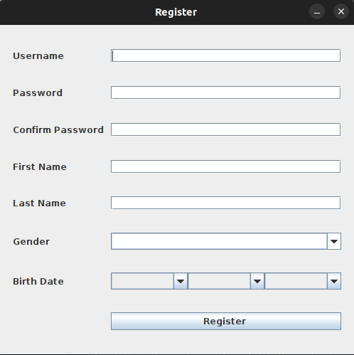
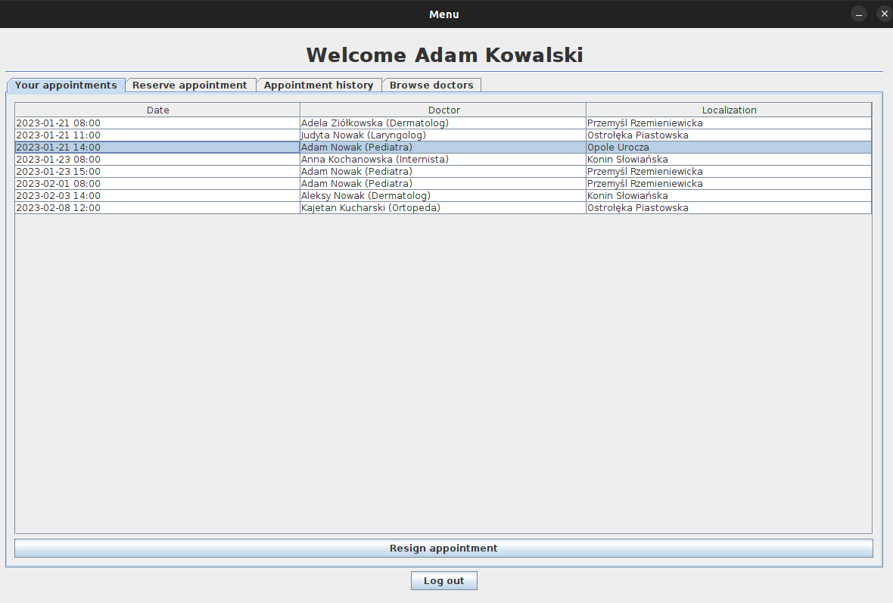
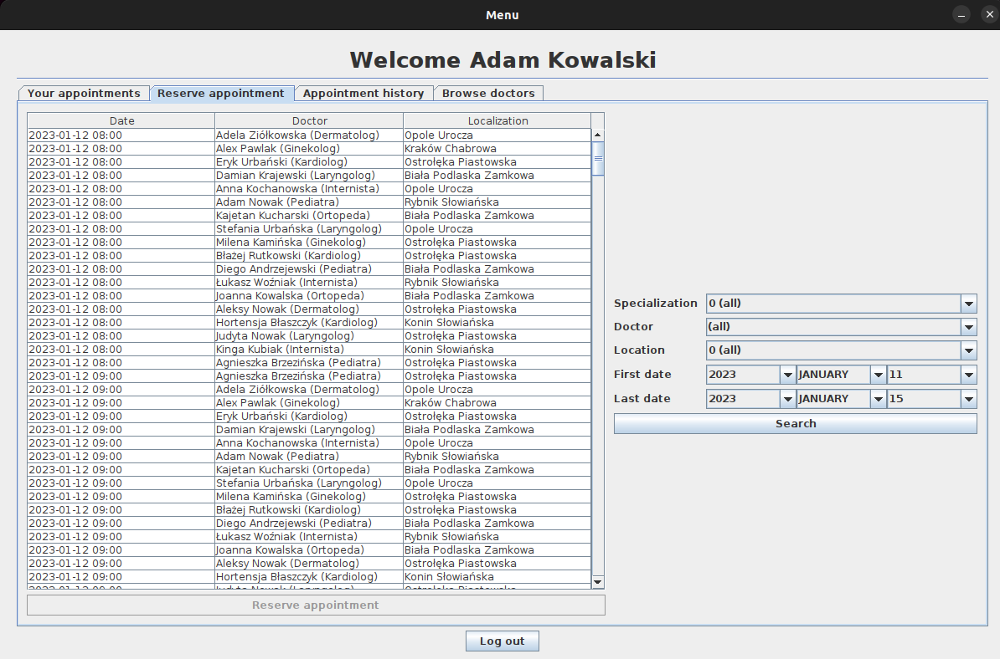
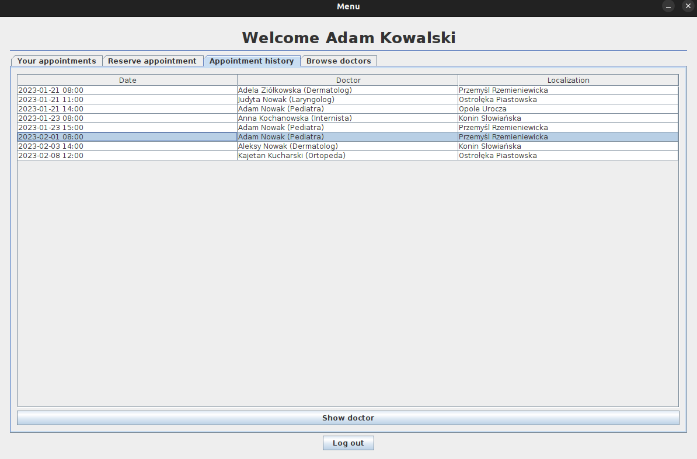
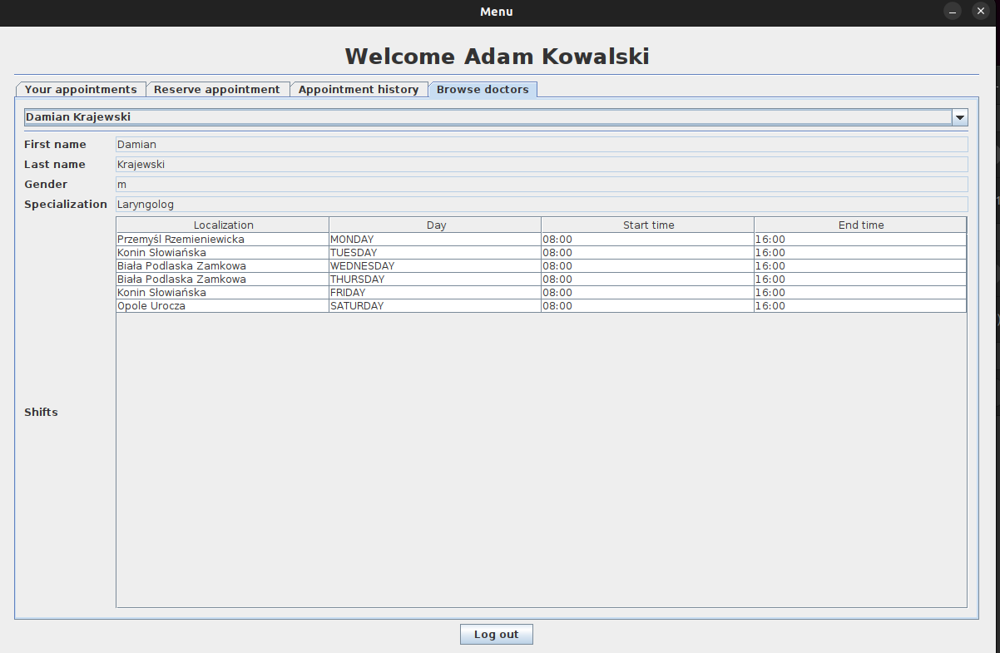

# Doctor Appointment Application

## Description
The application makes it possible to serve patients, in particular, to make an appointment with the selected specialist, at the corresponding free date.

The application was written using the Swing graphics library.

The application connects to mariaDB database.

## Login/Register View
Once the application is launched, the user is prompted to log in to the application using his nickname and password. 
If the user does not have an account, he has the option to register by providing his basic personal information, as well as choosing a convenient nickname and password for future login to the application.

## Menu View
After logging in, the patient is shown an interface that allows: making a new appointment, cancelling an existing appointment, reviewing attending physicians.

### Your Appointments View
Already scheduled appointments are immediately visible.
Removing an appointment involves selecting the appointment the user wants to cancel and returning it to the pool of free appointments.

### Reserve Appointment View
When making a new appointment, the patient selects the doctor's specialty of interest, the from-to date on which he would like to make the visit.
The application displays free appointments that can be selected by the user.

### Appointment History View
View that includes the appointments history by a single user.

### Browse Doctors View
The review of attending physicians feature is designed to help the user more easily find a specialist with whom he or she has already dealt, as well as read out past appointments 
- In case a re-consultation a year after the visit has been suggested, and the patient has forgotten who and when he or she conducted the visit.

## Used Modules
Download the [mariaDB](https://mariadb.com/kb/en/about-mariadb-connector-j/) database driver.

## Database
This repository supplies `docker-compose.yml` to start database server.

Example database: [app.sql](app.sql)